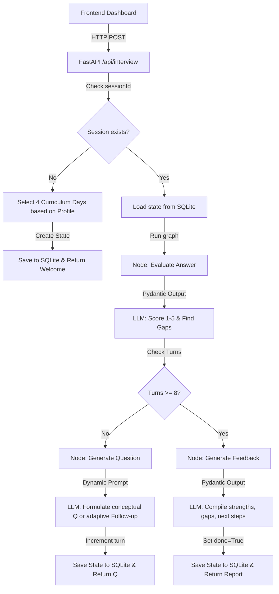

# The Interview Agent 🚀

An AI-powered, personalized technical interviewer built for the 31-day AI Cohort. The system assesses candidate progress, tailors multi-turn questions, adapts difficulty dynamically, and compiles final performance feedback.

---

## 📌 Project Goal

Create a realistic, personalized, multi-turn technical interview based on:
1.  **31-Day Curriculum JSON**: A structured outline of topics, objectives, and tools.
2.  **Candidate Profiles & Progress**: Individual records of passed, skipped, or struggled curriculum days.
3.  **Dynamic Interview State**: Adaptive questioning path based on candidate responses.

*Unlike generic chatbots, the application enforces the interview state, question limits, and curriculum coverage policies deterministically in code.*

---

## ⚙️ Core Requirements & Rules

*   **Assessment Length**: Administers exactly **8 questions**.
*   **Curriculum Coverage**: Covers at least **4 distinct curriculum days** (2 questions per day).
*   **Dynamic Follow-ups**: Formulates secondary questions depending on candidate response scores.
*   **Seniority Adaptation**: Adjusts question depth based on candidate experience (Junior vs. Senior).
*   **Evidence-based Feedback**: Compiles strengths, technical gaps, and roadmap recommendations at completion.
*   **State Control**: State transitions are controlled deterministically in Python (LangGraph) rather than relying on LLM prompting.

---

## 🏗️ Project Architecture

```text
project/
├── backend/       # FastAPI + Python + SQLite + LangGraph Backend
├── frontend/      # Next.js + React + Tailwind Frontend (Webpack dev)
├── ai/            # Project specifications, prompts, logs, and task tracking
└── AGENTS.md      # Rules and guidelines for subsequent developers
```



---

## 🔧 Environment Configuration

LLM keys and database paths are configured inside the backend environment file. 

Create a `.env` file inside the `backend/` directory (see [backend/.env.template](file:///d:/Projects/Interview%20Agent/backend/.env.template)):

```text
# LLM Provider Configuration: "gemini" or "openai" or "mock"
LLM_PROVIDER=mock

# Google Gemini Configuration
GEMINI_API_KEY=your_gemini_api_key_here
GEMINI_MODEL=gemini-2.5-flash

# OpenAI Configuration
OPENAI_API_KEY=your_openai_api_key_here
OPENAI_MODEL=gpt-4o-mini

# Database Configuration
DATABASE_URL=sqlite:///./interview_agent.db
```

> [!NOTE]
> *By default, the server runs in **`mock`** mode, allowing you to test the complete application offline without configuring LLM API keys.*

---

## 🚀 Running the Project

### 1. Run the Backend (FastAPI)
From the root workspace directory, run:
```bash
# Start backend server using the virtual environment interpreter
backend/.venv/Scripts/python.exe backend/run.py
```
*The backend API server will start on `http://127.0.0.1:8000`.*

### 2. Run the Frontend (Next.js)
Open a new terminal window, navigate to the `frontend/` directory, and run:
```bash
cd frontend
npm run dev
```
*The frontend dashboard will start on `http://localhost:3000`.*

---

## 🧪 Testing & Verification

We have implemented two verification suites inside the `backend/` directory:

### 1. Local Flow Simulation
Run the command below to simulate a full candidate interview (Sarah Johnson - Senior Data Engineer) inside the terminal, verifying LangGraph routing, scoring, and feedback generation:
```bash
backend/.venv/Scripts/python.exe backend/tests/simulate_interview.py
```

### 2. HTTP Endpoint Verification
Run the scratch script below to verify the FastAPI `/health` and `/api/interview` routes over HTTP:
```bash
# Runs test API requests
backend/.venv/Scripts/python.exe C:\Users\ASUS\.gemini\antigravity\brain\bd8f957e-134a-4561-8a48-44be7ef2522c\scratch\test_api.py
```

---

## 📄 Relevant Project Documentation

Refer to the files below in the `ai/` folder for logs, prompts, and design details:
*   [USER_PROMPTS.md](file:///d:/Projects/Interview%20Agent/ai/USER_PROMPTS.md) - History of all prompts submitted during development.
*   [PROMPTS.md](file:///d:/Projects/Interview%20Agent/ai/PROMPTS.md) - Detailed prompt templates and Pydantic schemas.
*   [USAGE_LOGS.md](file:///d:/Projects/Interview%20Agent/ai/USAGE_LOGS.md) - Transcript logs of a completed verification interview.
*   [DECISIONS.md](file:///d:/Projects/Interview%20Agent/ai/DECISIONS.md) - Record of core architectural decisions.
